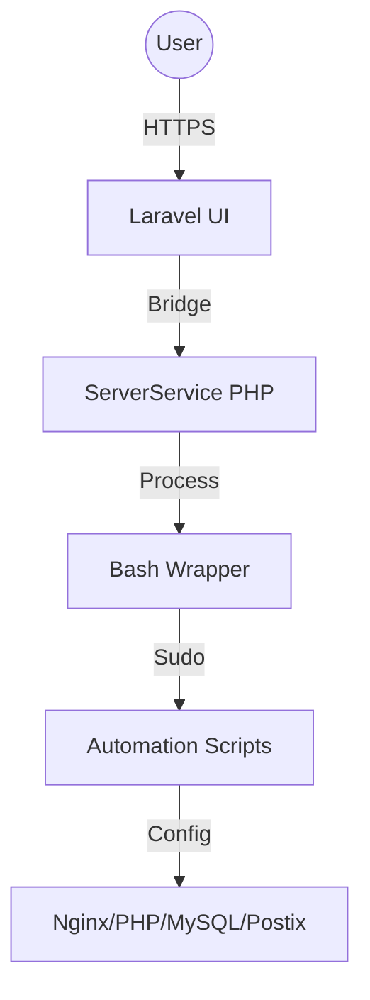

# SHM - Server Hosting Manager

SHM is a modern, lightweight, and secure alternative to WHM/cPanel, designed for VPS and dedicated servers. It combines the power of Laravel with robust Bash automation to provide a premium hosting management experience.

## ✨ Features

-   **Multi-Role Dashboard**: Seamless management for Super Admins, Resellers, and Clients.
-   **Automated Provisioning**: One-click site creation with Nginx, PHP-FPM, and MySQL.
-   **Security First**: Isolated Linux system users per hosting account, restricted sudo access, and UFW firewall management.
-   **Modern Stack**: Built with Laravel 10+, Tailwind CSS, Alpine.js, and Redis.
-   **SSL Automation**: Automatic Let's Encrypt certificates via Certbot.
-   **Complete Module Suite**:
    -   📁 **File Manager**: Web-based explorer with secure path navigation.
    -   📧 **Email Management**: Virtual mailboxes using Postfix and Dovecot.
    -   🌐 **DNS Manager**: BIND9 zone management.
    -   ⏰ **Cron Job Manager**: Schedule tasks via a simple UI.
    -   💾 **Backup System**: Account-wide backups (Files + DBs).

## 🚀 Installation

### 1. Pre-requisites
-   Clean installation of **Ubuntu 22.04 LTS** or **24.04 LTS**.
-   Root access or a user with sudo privileges.
-   At least 2GB of RAM (recommended).

### 2. Run the Infrastructure Installer
Clone the repository and run the master installation script:

```bash
git clone https://github.com/your-repo/shm.git /usr/local/shm
cd /usr/local/shm
sudo bash scripts/install.sh
```

### 3. Configure the Laravel Web Panel
Navigate to the panel directory and set up the environment:

```bash
cd /usr/local/shm/panel
cp .env.example .env
# Edit .env with your database and app settings
nano .env

# Install dependencies and migrate
php artisan key:generate
php artisan migrate --seed
php artisan storage:link
```

### 4. Security Configuration
Allow the panel user (e.g., `www-data`) to execute the SHM management CLI:

```bash
echo "www-data ALL=(ALL) NOPASSWD: /usr/local/bin/shm-manage" | sudo tee /etc/sudoers.d/shm
```

## 🛠 Usage

-   **Default Login**: `super_admin@shm.com` / `admin123` (Change immediately after login).
-   **Panel URL**: Access via your server's IP or configured hostname.

## 🏗 Architecture



## 📄 License
This project is licensed under the MIT License.
